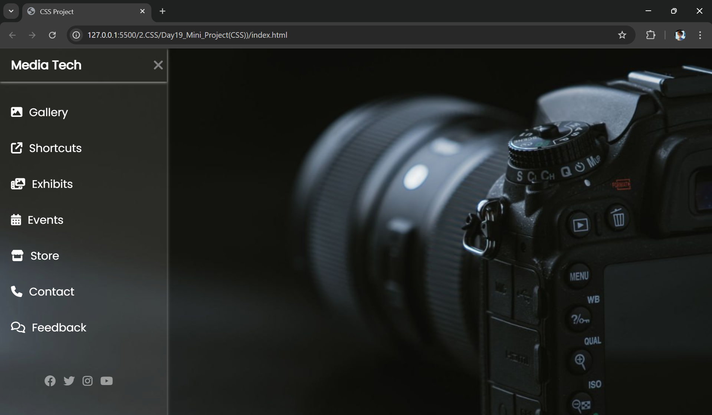

# 🎨 Sidebar Navigation Menu (HTML + CSS Project)

This is a simple and interactive **Sidebar Navigation Menu** built using only **HTML and CSS** — no JavaScript involved! The sidebar toggles in and out using the classic **checkbox hack**, enhanced with smooth transitions and stylish icons.

## 📸 Preview

## 🚀 Features

- 🔘 Slide-in Sidebar using Checkbox & Label (no JavaScript)
- 🎨 Modern UI with custom fonts (Poppins) and Font Awesome icons
- ✨ Smooth hover effects and transitions
- 📱 Responsive-friendly layout using absolute & fixed positioning
- 💡 Creative use of `input[type="checkbox"]` to toggle visibility

## 🛠️ Technologies Used

- **HTML5**
- **CSS3**
- **Font Awesome 6.4.0**
- **Google Fonts – Poppins**

## 📂 Folder Structure

📁 Sidebar-Menu-Project/
├── index.html
├── style.css
├── image.png (background image)

less
Copy
Edit

## 🧠 What I Learned

- How to create a sidebar layout without Flexbox or JavaScript  
- How `position: absolute` and `fixed` can be combined for layout control  
- How to use transitions and hover states for interactivity  
- Importance of layering and managing `input` visibility creatively  

## 🚧 Future Improvements

- Add Flexbox or Grid to improve responsiveness  
- Include JavaScript for enhanced functionality (like animations or submenu toggles)  
- Make it mobile-friendly with media queries  

## 📞 Connect With Me

👨‍💻 Rohit Kumar  
🔗 [LinkedIn](https://www.linkedin.com/in/dev-rohitkumar)  
🐙 [GitHub](https://github.com/dev-rohitkumar) 
✨ [x.com(Formerly Twitter)](https://x.com/dev_rohitkumar) 

---

Made with 💻 and a lot of Google searches 😄